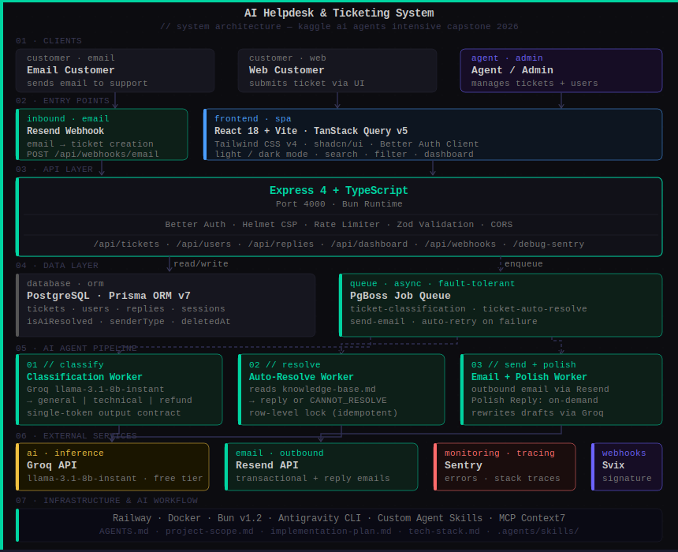

# AI Helpdesk & Ticketing System

> A production-deployed, full-stack AI helpdesk that classifies, resolves, and replies to support tickets autonomously — before a human ever sees them.

[](https://ai-powered-helpdesk-and-ticketing-system.up.railway.app)
[](#testing)
[](https://www.kaggle.com/competitions/vibecoding-agents-capstone-project/projects)
[](LICENSE)

**Track:** Kaggle AI Agents Intensive Capstone — Agents for Business (Google × Kaggle 2026)

🌐 **Live Demo:** https://ai-powered-helpdesk-and-ticketing-system.up.railway.app
📄 **Kaggle Writeup:** https://www.kaggle.com/competitions/vibecoding-agents-capstone-project/projects
🎬 **Demo Video:** *(YouTube link)*
💻 **GitHub:** https://github.com/ays19/HELPDESK

> **Demo credentials**
> Email: `admin@example.com` · Password: `password123`

---

## Table of Contents

- [Overview](#overview)
- [Agent Architecture](#agent-architecture)
- [Key Features](#key-features)
- [Tech Stack](#tech-stack)
- [Project Structure](#project-structure)
- [Getting Started](#getting-started)
- [Environment Variables](#environment-variables)
- [Development](#development)
- [Testing](#testing)
- [Deployment](#deployment)
- [Reproducing the Deployment](#reproducing-the-deployment)
- [API Reference](#api-reference)
- [Key Implementation Notes](#key-implementation-notes)
- [AI Development Workflow](#ai-development-workflow)
- [License](#license)
- [Citation](#citation)

---

## Overview

Every growing software business hits the same wall: a support inbox that grows faster than the team can handle it. Agents spend most of their time on repetitive, predictable tickets — password resets, billing questions, access issues — questions that have clear, documented answers.

**The core insight:** most support tickets should never reach a human agent at all.

The AI Helpdesk & Ticketing System uses a **three-agent pipeline** to handle the entire ticket lifecycle autonomously:

1. A customer sends an email or submits a ticket via the web UI
2. **Agent 1** classifies it (General / Technical / Refund) using Groq
3. **Agent 2** reads the knowledge base and resolves it — sending the reply email automatically
4. If it cannot resolve it, the ticket is escalated to a human agent with the classification already done

For tickets that reach a human, **Agent 3** can polish their draft reply into professional, empathetic language before it is sent.

---

## Agent Architecture



```
Inbound Email / Web Form
         │
         ▼
┌─────────────────────┐
│   Ticket Creation   │  status: new
└────────┬────────────┘
         │  PgBoss queues job: ticket-classification
         ▼
┌─────────────────────────────────────────────┐
│   Agent 1 — Classification Worker           │
│                                             │
│  • Reads ticket title + description         │
│  • Calls Groq (llama-3.1-8b-instant)        │
│  • Returns one of:                          │
│    general_question | technical_question    │
│    | refund_request                         │
│  • Updates ticket category                  │
│  • Transitions status: new → open           │
└────────┬────────────────────────────────────┘
         │  PgBoss queues job: ticket-auto-resolve
         ▼
┌─────────────────────────────────────────────┐
│   Agent 2 — Auto-Resolve Worker             │
│                                             │
│  • Reads full knowledge-base.md             │
│  • Calls Groq with ticket + KB context      │
│  • Binary contract:                         │
│    ├── Complete reply → isAiResolved=true   │
│    │   → PgBoss queues: send-email          │
│    │   → Customer receives resolution email │
│    └── CANNOT_RESOLVE → stays open          │
│        for human agent                      │
└─────────────────────────────────────────────┘
         │  (on-demand, human-triggered)
         ▼
┌─────────────────────────────────────────────┐
│   Agent 3 — Polish Reply (On-Demand)        │
│                                             │
│  • Human agent drafts a reply               │
│  • Clicks "Polish"                          │
│  • Groq rewrites in professional tone       │
│  • Agent reviews and sends                  │
└─────────────────────────────────────────────┘
```

**Why a queue-based pipeline?**

Using PgBoss (a PostgreSQL-backed job queue) rather than a simple `await` chain gives the agent pipeline:

- **Fault tolerance** — if an LLM call fails, PgBoss retries the job automatically
- **No blocking** — ticket creation returns immediately; AI processing is asynchronous
- **Idempotency** — row-level locking (`SELECT ... FOR UPDATE`) prevents duplicate AI replies on retried jobs
- **Visibility** — jobs are persisted in the database, making failures inspectable

---

## Key Features

### AI Features
| Feature | Description |
|---|---|
| Auto-classification | Classifies every ticket into one of three categories using Groq |
| Auto-resolution | Resolves tickets from the knowledge base; sends reply email automatically |
| Polish Reply | Rewrites human draft replies into professional, empathetic language |
| Ticket Summarization | One-click LLM summary of any ticket's full conversation thread |
| Inbound email → ticket | Converts inbound customer emails into tickets via Resend webhook |
| Outbound email | Sends AI-generated and agent replies to customers via Resend |

### Ticket Management
| Feature | Description |
|---|---|
| Search | Real-time keyword search across all tickets |
| Status filter | One-click filter: All / Open / In-Progress / Resolved / Closed |
| Priority indicators | 🟢 Low · 🟡 Medium · 🟠 High · 🔴 Critical |
| Category badges | AI-assigned category visible on every ticket card |
| Newest-first ordering | Enforced server-side, consistent at any scale |
| Light / dark mode | Full theme toggle — Obsidian Jade dark theme + clean light theme |

### Admin & Security
| Feature | Description |
|---|---|
| Role-based access control | Admin and Agent roles; sign-up disabled by design |
| User management | Admin provisions all agent accounts |
| Analytics dashboard | Total tickets, AI resolution rate, avg resolution time, traffic chart |
| Sentry error tracking | Full stack traces and source maps in production |
| XSS prevention | Three layers: Helmet CSP + React 18 escaping + Zod input validation |

---

## Tech Stack

| Layer | Technology |
|---|---|
| Runtime | Bun |
| Backend | Express 4 + TypeScript |
| Frontend | React 18 + Vite + TanStack Query v5 |
| Styling | Tailwind CSS v4 + shadcn/ui |
| Auth | Better Auth (email/password, admin plugin) |
| Database | PostgreSQL + Prisma ORM v7 |
| AI | Vercel AI SDK + Groq (`llama-3.1-8b-instant`) |
| Job Queue | PgBoss (PostgreSQL-backed async queue) |
| Email | Resend (transactional + inbound webhooks) |
| Validation | Zod (shared schemas in `core/`) |
| Error Monitoring | Sentry (Node + React) |
| Testing | Vitest + React Testing Library + Playwright (E2E) |
| Deployment | Railway + Docker |
| AI Coding Agent | Antigravity CLI |
| MCP Servers | Context7 (live documentation access) |

---

## Project Structure

```
.
├── src/                        # Express backend
│   ├── server.ts               # App entry point, middleware, route registration
│   ├── auth.ts                 # Better Auth configuration
│   ├── knowledge-base.md       # AI agent's knowledge source (support policies)
│   ├── lib/
│   │   ├── queue.ts            # PgBoss workers — classification, auto-resolve, send-email
│   │   ├── ai.ts               # Groq LLM calls (classify, resolve, polish, summarize)
│   │   └── email.ts            # Resend outbound email helpers
│   └── routes/                 # Express route handlers
│       ├── tickets.ts
│       ├── users.ts
│       ├── replies.ts
│       ├── dashboard.ts
│       └── webhooks.ts
│
├── client/                     # React frontend (Vite)
│   └── src/
│       ├── components/         # shadcn/ui + custom components
│       │   └── __tests__/      # 67 Vitest component tests
│       ├── pages/              # Route-level page components
│       │   └── __tests__/      # 51 Vitest page tests
│       ├── lib/
│       │   ├── auth-client.ts  # Better Auth client
│       │   └── api.ts          # Axios instance + API helpers
│       └── main.tsx
│
├── core/                       # Shared TypeScript types + Zod schemas
│   └── src/schemas/            # ticket.ts, user.ts, reply.ts
│
├── prisma/
│   ├── schema.prisma           # Data model
│   ├── migrations/             # Migration history
│   └── src/seed.ts             # Seeds admin + AI agent user
│
├── e2e/                        # Playwright end-to-end tests (27 tests)
│   ├── auth.spec.ts
│   ├── tickets.spec.ts
│   ├── ticket-details.spec.ts
│   ├── users.spec.ts
│   └── webhooks.spec.ts
│
├── scripts/
│   ├── reset-admin.ts          # Deletes and re-seeds the admin user
│   └── seed-100-tickets.ts     # Seeds demo ticket data
│
├── .agents/skills/             # Custom AI agent instruction sets
│   ├── better-auth-best-practices/
│   ├── e2e-test-writer/
│   ├── frontend-design/
│   └── security-reviewer/
│
├── AGENTS.md                   # AI coding agent rules and project context
├── project-scope.md            # Goals, non-goals, system boundaries
├── implementation-plan.md      # Phased build order and dependencies
├── tech-stack.md               # Technology choices and rationale
├── architecture.svg            # System architecture diagram
├── Dockerfile
└── .env.example
```

---

## Getting Started

### Prerequisites

- [Bun](https://bun.sh) v1.2+
- PostgreSQL 14+ (local or cloud)
- [Groq API key](https://console.groq.com/) (free tier available)
- [Resend API key](https://resend.com/) (for email features)
- [Sentry](https://sentry.io/) DSN (optional — for error monitoring)

### 1. Clone the repository

```bash
git clone https://github.com/ays19/HELPDESK.git
cd HELPDESK
```

### 2. Install dependencies

```bash
bun install
```

This installs dependencies for the root, `client/`, and `core/` workspaces in one command.

### 3. Configure environment variables

```bash
cp .env.example .env
```

Open `.env` and fill in the required values. See [Environment Variables](#environment-variables) for the full reference.

### 4. Set up the database

```bash
# Run all migrations
bunx prisma migrate dev

# Seed the admin user and AI agent user
bun run db:seed
```

The seed script creates two accounts using the credentials from your `.env`:
- **Admin:** `SEED_ADMIN_EMAIL` / `SEED_ADMIN_PASSWORD`
- **AI Agent:** `ai@example.com` (internal use only — handles AI-resolved tickets)

### 5. Start the development servers

```bash
bun run dev:all
```

| Service | URL |
|---|---|
| Express API | http://localhost:4000 |
| React frontend | http://localhost:5173 |

> **Important:** Always use `bun run dev:all` for local development. The frontend at port 5173 proxies all `/api` requests to the backend at port 4000. Starting only the Vite server will cause authentication and all API calls to fail.

---

## Environment Variables

Copy `.env.example` to `.env` and fill in the values below.

| Variable | Required | Description |
|---|---|---|
| `DATABASE_URL` | ✅ | PostgreSQL connection string |
| `BETTER_AUTH_SECRET` | ✅ | Session signing secret — any random string, min 32 chars |
| `BETTER_AUTH_URL` | ✅ | Backend URL — `http://localhost:4000` in dev |
| `TRUSTED_ORIGINS` | ✅ | Frontend URL for CORS — `http://localhost:5173` in dev |
| `SEED_ADMIN_EMAIL` | ✅ | Email for the seeded admin account |
| `SEED_ADMIN_PASSWORD` | ✅ | Password for the seeded admin account |
| `GROQ_API_KEY` | ✅ | Groq API key — [console.groq.com](https://console.groq.com/) |
| `RESEND_API_KEY` | ✅ | Resend API key — [resend.com](https://resend.com/) |
| `WEBHOOK_SECRET` | ✅ | Secret for validating inbound email webhooks (Resend → Svix) |
| `SENTRY_DSN` | ⬜ | Sentry DSN for backend error tracking |
| `VITE_SENTRY_DSN` | ⬜ | Sentry DSN for frontend error tracking |
| `SENTRY_AUTH_TOKEN` | ⬜ | Sentry auth token for source map uploads |
| `SENTRY_ORG` | ⬜ | Sentry organisation slug |
| `SENTRY_PROJECT` | ⬜ | Sentry project slug |

> **E2E Testing:** Create a separate `.env.test` file pointing to a test database (e.g. `helpdesk_test`) with test server ports `4100` and `5174`. The test suite resets and re-seeds this database before every run.

---

## Development

```bash
# Both servers (recommended)
bun run dev:all

# Backend only (Express on port 4000)
bun run dev

# Frontend only (Vite on port 5173)
bun run dev:client

# Type check (no emit)
bun run typecheck

# Reset and re-seed the admin user
bun run scripts/reset-admin.ts

# Seed 100 demo tickets for a realistic dashboard
bun run scripts/seed-100-tickets.ts
```

---

## Testing

The project has **145 tests across 20 files**.

### Unit + Component Tests — Vitest + React Testing Library (118 tests)

```bash
cd client && bun run test
```

| File group | Files | Tests |
|---|---|---|
| Component tests | 9 files | 67 tests |
| Page tests | 6 files | 51 tests |

Covers: TicketCard, ReplyForm, CreateTicketModal, UserModal, UserTable, LoginForm, ThemeToggle, TicketDetail, DeleteUserModal, TicketDetails (×3 files), TicketsList, Users, Home.

### E2E Tests — Playwright (27 tests)

> E2E tests require a separate `.env.test` file and a test database.

```bash
# Headless
bun run test:e2e

# Interactive UI mode (recommended)
bun run test:e2e:ui

# Debug mode
bun run test:e2e:debug
```

The `test:e2e` command automatically:
1. Resets the test database to a clean state
2. Runs all Prisma migrations against the test DB
3. Seeds the test admin user
4. Runs all 27 Playwright specs in parallel

| Spec file | Tests | Covers |
|---|---|---|
| `auth.spec.ts` | 4 | Login, session, sign out |
| `tickets.spec.ts` | 4 | Create, list, status update |
| `ticket-details.spec.ts` | 3 | Reply thread, AI badge |
| `users.spec.ts` | 7 | CRUD, role enforcement |
| `webhooks.spec.ts` | 9 | Inbound email → ticket creation |

---

## Deployment

### Railway (recommended)

The project is live at: **https://ai-powered-helpdesk-and-ticketing-system.up.railway.app**

On every Railway deploy, the `start` command runs automatically:

```bash
bunx prisma migrate deploy   # runs pending migrations
bun run db:seed              # creates admin if not exists (idempotent)
bun run src/server.ts        # starts the Express server (serves built client)
```

Set all environment variables from the [Environment Variables](#environment-variables) section in your Railway project settings before deploying.

### Docker

```bash
# Build the image
docker build -t helpdesk .

# Run with environment variables
docker run -p 4000:4000 \
  -e DATABASE_URL="postgresql://..." \
  -e BETTER_AUTH_SECRET="..." \
  -e BETTER_AUTH_URL="http://localhost:4000" \
  -e TRUSTED_ORIGINS="http://localhost:4000" \
  -e GROQ_API_KEY="..." \
  -e RESEND_API_KEY="..." \
  -e WEBHOOK_SECRET="..." \
  -e SEED_ADMIN_EMAIL="admin@example.com" \
  -e SEED_ADMIN_PASSWORD="your-password" \
  helpdesk
```

The Docker image:
- Installs all dependencies with `bun install --frozen-lockfile`
- Generates the Prisma client (`bunx prisma generate`)
- Builds the React frontend into `client/dist/`
- Exposes port 4000
- On container start: runs migrations → seeds admin → starts server

---

## Reproducing the Deployment

To reproduce the exact Railway deployment from source:

1. Fork the repository: https://github.com/ays19/HELPDESK
2. Create a new Railway project and connect your fork
3. Add a PostgreSQL plugin in Railway (auto-sets `DATABASE_URL`)
4. Set all required environment variables listed in the [Environment Variables](#environment-variables) section
5. Railway detects the `Dockerfile` automatically and builds it
6. On first deploy, the `start` command runs migrations and seeds the admin user
7. The app is served on a Railway-provided domain at port 4000

No manual migration or seed step is required — the `start` command handles everything automatically and is idempotent (safe to run on every deploy).

---

## API Reference

### Authentication
| Method | Endpoint | Description |
|---|---|---|
| POST | `/api/auth/sign-in/email` | Sign in with email + password |
| POST | `/api/auth/sign-out` | Sign out |
| GET | `/api/auth/get-session` | Get current session |

### Tickets
| Method | Endpoint | Auth | Description |
|---|---|---|---|
| GET | `/api/tickets` | Agent | List all tickets (status filter + search) |
| GET | `/api/tickets/:id` | Agent | Get single ticket with full reply thread |
| POST | `/api/tickets` | Agent | Create a new ticket |
| PATCH | `/api/tickets/:id` | Agent | Update ticket (status, priority, assignee) |
| DELETE | `/api/tickets/:id` | Admin | Soft-delete a ticket |
| POST | `/api/tickets/:id/summarize` | Agent | Generate AI summary of ticket thread |

### Replies
| Method | Endpoint | Auth | Description |
|---|---|---|---|
| POST | `/api/tickets/:id/replies` | Agent | Send a reply (triggers outbound email) |
| POST | `/api/tickets/:id/replies/polish` | Agent | Polish a draft reply via AI |

### Users (Admin only)
| Method | Endpoint | Auth | Description |
|---|---|---|---|
| GET | `/api/users` | Admin | List all users |
| POST | `/api/users` | Admin | Create a new agent account |
| PUT | `/api/users/:id` | Admin | Update a user |
| DELETE | `/api/users/:id` | Admin | Soft-delete a user |

### Dashboard
| Method | Endpoint | Auth | Description |
|---|---|---|---|
| GET | `/api/dashboard/stats` | Admin | Ticket stats (total, open, AI resolved, avg time) |
| GET | `/api/dashboard/traffic` | Admin | Daily ticket traffic for chart |

### Webhooks
| Method | Endpoint | Auth | Description |
|---|---|---|---|
| POST | `/api/webhooks/email` | Svix signature | Inbound email → ticket creation |
| GET | `/debug-sentry` | None | Triggers a test Sentry error |

---

## Key Implementation Notes

These are the most architecturally significant parts of the codebase. Judges reviewing the code should look here first.

### `src/lib/queue.ts` — The Agent Pipeline

This file contains all three PgBoss worker registrations. Key design decisions documented in comments:

- **Binary output contract** — the auto-resolve worker is explicitly constrained to return either a complete reply or the exact string `CANNOT_RESOLVE`. No partial replies, no hedging. This eliminates a class of downstream error handling.
- **Row-level locking** — the auto-resolve worker uses `SELECT ... FOR UPDATE` inside a transaction to prevent duplicate AI replies when PgBoss retries a failed job. The pre-check outside the transaction acts as a fast-path guard.
- **Three named queues** — `ticket-classification`, `ticket-auto-resolve`, and `send-email` are registered at server startup. Each worker has a single, well-defined responsibility.

### `src/knowledge-base.md` — The Agent's Brain

The auto-resolve worker reads this entire file on every job execution and passes it to Groq as context. It is the agent's only source of truth. The agent is explicitly instructed not to invent information outside this file.

### `prisma/schema.prisma` — Data Model Design

Key fields that reflect agent decisions:
- `isAiResolved: Boolean` — flags tickets resolved without human intervention; enables the dashboard's AI resolution rate metric
- `senderType: agent | customer` on `TicketReply` — distinguishes AI-generated from human-generated replies
- `status: TicketStatus` — tracks the pipeline state (`new → processing → open → resolved`)
- `deletedAt` — soft-delete on all user records; never hard-deleted

### `src/server.ts` — Security Middleware

Helmet, CORS, and rate limiting are applied at the Express app level before any routes are registered. The trust proxy configuration is set for Railway's reverse proxy environment.

---

## AI Development Workflow

This project was built with [Antigravity CLI](https://antigravity.dev) as the primary AI coding agent, with [MCP Context7](https://context7.com) providing live library documentation during development.

### Planning Documents

| File | Purpose |
|---|---|
| `AGENTS.md` | Project memory — AI agent rules, stack reference, env vars, testing constraints |
| `project-scope.md` | Goals, non-goals, and system boundaries |
| `implementation-plan.md` | Phased build order and feature dependencies |
| `tech-stack.md` | Technology choices with rationale |

### Custom Agent Skills

The `.agents/skills/` directory contains four reusable instruction sets that kept AI-assisted development consistent:

| Skill | Purpose |
|---|---|
| `better-auth-best-practices/` | Authentication patterns and session handling rules |
| `e2e-test-writer/` | Playwright test writing conventions for this codebase |
| `frontend-design/` | UI component and styling constraints |
| `security-reviewer/` | Security checklist — enforced Helmet, Zod, and XSS rules |

### Why This Approach Works

Every new Antigravity CLI session reads `AGENTS.md` first. This means the AI coding agent always knows the stack, the testing rules, the architectural constraints, and the environment variables — without re-explaining them. The custom skills enforce consistency across authentication, testing, and security patterns session after session. This is what made it possible to build a production-grade system with AI assistance while maintaining code quality throughout.

---

## License

**Code:** MIT — see [LICENSE](LICENSE) for details.

**Kaggle Writeup:** Released under the [Attribution 4.0 International (CC BY 4.0)](https://creativecommons.org/licenses/by/4.0/) license.

---

## Citation

```
AHSAN YASIR SHARAR. HELPDESK: AI Agents That Resolve Support Tickets Before a Human Sees Them.
https://www.kaggle.com/competitions/vibecoding-agents-capstone-project/writeups/new-writeup-1783086059176
2026. Kaggle.
```

---

*Built with Bun · Express · React · PostgreSQL · Prisma · PgBoss · Groq · Resend · Sentry · Deployed on Railway*